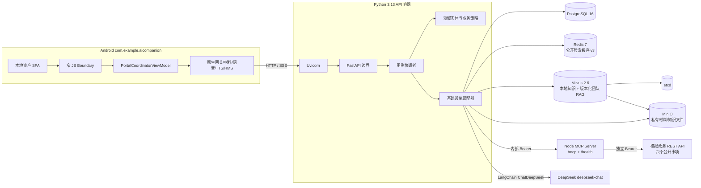
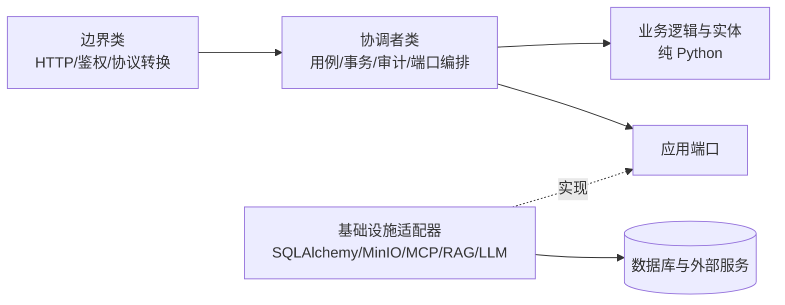
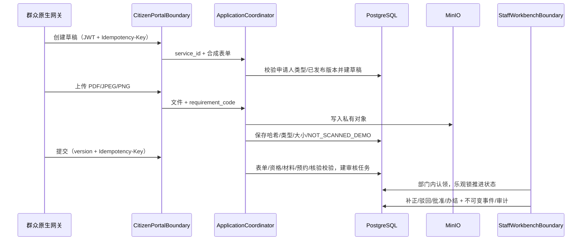

# 智慧政务“一网通办”架构

## 目标与边界

系统在本地 Compose 中跑通 Android → FastAPI → PostgreSQL/Redis/Milvus/MinIO/MCP → 模拟政务 API 与 DeepSeek。FastAPI 是模块化单体和业务写入入口；MCP 是独立 Node Streamable HTTP 服务，只提供公开目录只读工具。PostgreSQL 是内部事项、账号、办件和审计的权威源。

当前数据和 Provider 全是本地演示：不连接真实政务、身份、人脸、支付、银行、短信或邮寄平台。模型输出只能解释和建议，任何状态变更都必须经过显式业务 API、鉴权、规则校验、幂等和审计。

## 本地部署拓扑

Uvicorn 仅运行 ASGI 应用，不承担 MCP 或额外业务角色。除 API `127.0.0.1:8000` 和 PostgreSQL 调试端口 `127.0.0.1:15432` 外，其余服务默认只在 Compose 网络中开放。

## 模块化单体与依赖方向

后端依赖方向固定为：

- `app/domain` 不依赖 FastAPI、SQLAlchemy、Redis、Milvus、MCP 或 Android。
- 领域实体使用普通 `dataclass`/枚举；数据库映射位于 `infrastructure/records.py`，统一以 `*Record` 命名。
- Boundary 只校验输入、鉴权和转换协议，不决定业务状态。
- Coordinator 编排一次用例并调用 Repository/Provider；Policy 独立判断资格、材料、状态、分派、权限和溯源。
- `ConsultationCoordinator` 是聊天的 BCE 用例协调者；`app/chat.py` 仅保留向后兼容的强类型 facade，Boundary 通过 DTO/Port 调用协调者，不直接访问缓存、MCP、Milvus 或模型。
- `infrastructure/runtime.py` 是组合根，只负责把 Repository、安全、对象存储和各外部适配器注入协调者，不承载业务决策。
- PostgreSQL 事务同时写办件事件和业务审计，已提交办件不物理删除。

具体类和状态见 [业务与领域设计](business-design.md)。

## 关键数据流

### 公开咨询

1. WebView 将枚举化命令交给 `PortalJsBoundary`，原生 `StreamingGateway` 或普通网关请求 FastAPI。
2. `ConsultationCoordinator` 从 PostgreSQL 的已发布目录建立执行上下文；歧义（例如“社保”）直接返回多个候选，不调用检索或模型。
3. 对已选择事项，协调者用事项 UUID、编码、标题和简介等白名单公开字段生成 `local_catalog` 来源；字段经过公开文本脱敏，不从模型或 Mock API 反推。
4. Redis 只缓存 MCP/RAG 检索上下文。v3 键为 `SHA-256(规范化公开问题|service:外部事项映射 ID|dataset:数据集版本)`；dataset 版本参与隔离，本地团队 RAG 未启用时为 `none`，云端固定为 `team-2026-08-22-v1`。`local_catalog` 每次从 PostgreSQL 当前版本重建，因此不会被旧缓存覆盖。
5. 缓存未命中时，MCP 与组合知识检索器并行工作：MCP 通过五个只读工具访问 Mock API；组合检索器并行查询 256 维本地知识和可选的 1,024 维团队语料，再以 RRF 融合排名。任一知识后端故障时保留另一侧结果并返回降级 warning。
6. 有至少一个有效可核验来源时，LangChain 才把公开问题与来源交给 DeepSeek；`local_catalog`、`mcp`、`rag` 三类来源保持独立标识，回答和工具审计持久化到 PostgreSQL。
7. `/chat/stream` 固定输出 `meta`、`delta`、`done` 或 `error` SSE 事件；Android 最终使用 `TextToSpeech` 播报，原始音频不上传。

若问题绑定 `application_id`，必须登录并经过授权查询；后端直接返回受控的办件状态描述，不将私人办件上下文发送给 Redis、MCP、Milvus 或 LLM。

### 办件与审核

每次材料上传和状态变更都会推进 `version`。客户端必须使用最新版本；并发冲突返回 409。副作用接口使用 `(actor, scope, Idempotency-Key, payload hash)` 去重，相同键不同载荷拒绝执行。

### 事项与知识发布

管理员创建事项时生成版本 1；后续修改创建新 `ServiceVersion`。已发布版本不可原地改写，生命周期策略控制发布、暂停、恢复和终止。管理员上传 PDF/DOCX/TXT/Markdown 后，文件进入知识 bucket，文本切分为 `KnowledgeChunk`，索引任务以 `INDEXING` 分阶段写入 `gov_knowledge_v2`，全部向量成功发布后才进入 `ACTIVE`。

索引/发布失败会持久化 `INDEX_FAILED`；首次失败的结构化 409 在 `detail.job_id` 返回任务标识，管理员用该 ID 和幂等键重试。进程启动会把遗留的 `INDEXING` 任务恢复成可重试的 `INDEX_FAILED`，并以 PostgreSQL 的 ACTIVE 知识块重新激活 Milvus，保证持久卷升级后仍可检索。管理员可归档 `ACTIVE/SUPERSEDED` 任务：元数据和审计保留，若无同文档的其他 ACTIVE 任务，则知识块转为 `ARCHIVED` 并从向量检索移除。重试/归档成功会使公开 Redis 缓存失效。当前没有独立知识任务列表 API，调用方需保存上传响应或失败详情中的 `job_id`。

团队 RAG 不经管理员 HTTP 接口导入，而是由服务器运维协调者读取净化后的 data-only ZIP。`0005_rag_corpus` 持久化数据集清单、15,858 个内容分块的可恢复检查点以及按内容哈希/模型/维度去重的 embedding 缓存；导入器以固定批次调用 DashScope `text-embedding-v4`（1,024 维），写入版本化内容/路由 collection，最后才原子切换两个 alias。固定数据集另有 1,012 条文档路由向量，用于先选最多三个主题再检索正文。原始归档中的代码、密钥和原生向量不会进入净化产物。

## Android 架构与原生边界

Android 使用单 Activity 安全 WebView 宿主：

- 边界：`PortalJsBoundary`、`DocumentPickerBoundary`、`VoiceCaptureBoundary`、`TextToSpeechBoundary`、`WindowMapBoundary`；
- 协调者：`PortalCoordinatorViewModel`、`AuthCoordinator`、`CitizenCoordinator`、`StaffTaskCoordinator`、`AdminCoordinator`、`VoiceConsultationCoordinator`；
- 业务策略：`PortalCommandPolicy`、`DynamicFormValidator`、`MaterialCompletionPolicy`、`RoleNavigationPolicy`、`SensitiveDisplayPolicy`；
- 网关：Auth/Catalog/Application/Staff/Admin/Streaming 的 OkHttp 实现及 `AndroidKeystoreSessionStore`。

JS 不能指定任意 URL、HTTP 方法、原生类名、坐标或外部链接；角色与命令需通过 `PortalCommandPolicy`。WebView 不接触 access/refresh token，结果由可观察 ViewModel 状态回传，避免 Activity 重建时回调持有旧实例。

## 数据隔离与安全

| 数据 | 存储/处理 | 禁止事项 |
| --- | --- | --- |
| 公开事项/知识 | PostgreSQL、Milvus、Redis v3、MCP/Mock | 不宣称真实政策；团队语料标记为未核验演示参考 |
| 账号/JWT refresh hash | PostgreSQL；Android Token 在 Keystore 加密存储 | 不进入 WebView/日志/明文偏好 |
| 私人表单/办件 | PostgreSQL 授权查询 | 不进入公共缓存或 LLM 上下文 |
| 材料 | MinIO 私有 bucket + PostgreSQL 哈希元数据 | 不生成公共直链、不在 WebView 直接打开 |
| 生物/支付/邮寄 | 仅状态与模拟引用 | 不采集生物数据、不发生真实资金/快递 |
| 凭据 | 被忽略的 `.env`/容器环境 | 不进入 APK、API 响应或提交历史 |

JWT access token 默认 15 分钟，refresh token 默认 7 天且只保存哈希。冻结账号会递增 `token_version` 并撤销 refresh token，使已有令牌失效。工作人员只处理所属部门/窗口任务；管理员管理目录和人员，但不能代替工作人员审批。

## 故障和降级边界

- PostgreSQL 不可用：核心请求返回结构化 503，不创建无法持久化的结果。
- DeepSeek 不可用：返回结构化 502，不用模板冒充模型答案。
- Redis 不可用：公开咨询绕过缓存；私人数据本来就不使用公共缓存。
- MCP 或 Milvus 单项不可用：使用剩余公开来源回答，并在 `warnings` 明示降级；本地/团队知识后端也可彼此降级。
- MinIO 不可用：材料/知识文件操作失败；API 就绪检查必须反映全栈依赖状态。
- `/health/live` 只检查 API 进程。团队 RAG 关闭时，`/health/ready` 聚合 PostgreSQL、Redis、Milvus、MCP、Mock API、MinIO 和业务种子共 7 项；启用时增加 `rag_corpus` 为 8 项，并核对版本化内容/路由 alias 及 15,858 + 1,012 的精确行数。任一启用中的依赖失败均返回 503。

## 数据迁移与回退边界

迁移链为 `0001_initial → 0002_identity_catalog → 0003_applications_operations → 0004_knowledge_audit → 0005_rag_corpus`。旧匿名聊天保留，新 `owner_account_id` 可为空且不会自动归属后来注册的用户。`0005` 只新增 `knowledge_datasets`、`knowledge_corpus_chunks` 和 `knowledge_embedding_cache`，不覆盖管理员知识表。Milvus 保留 `gov_knowledge_v2`，团队语料使用带版本/归档哈希的 collection 和活动 alias；Redis 使用 `smart-gov:retrieval:v3:*`，dataset 版本使新旧检索结果天然隔离。

`scripts/migrate.ps1` 仅执行 `upgrade head` 和状态检查；普通 `dev-down.ps1` 保留命名卷。需要回退应用时应先做数据库/对象存储备份并制定兼容策略，不能用自动 downgrade 代替数据恢复。

## 云端演示拓扑

`compose.cloud.yaml` 将 API 只绑定到服务器回环地址 `127.0.0.1:18000`；Nginx 使用官方 lego v5.4.0 通过 HTTP-01 管理 Let’s Encrypt `shortlived` IP 证书，对外提供 TLS 1.2/1.3、HTTP→HTTPS 重定向、SSE 关闭缓冲、请求体限制和接口限流。TCP 80 持续开放用于短证书无停机续期。Docker secrets 只读注入数据库、JWT、内部 Token、DeepSeek 与 DashScope 凭据。首次发布、团队 RAG 付费导入、一次付费聊天验收和 Nginx 流量切换分别需要显式确认，失败时不会自动停掉旧服务。

云端 Android APK 只能编译进无凭据、无路径的 HTTPS origin，且 debug/release 均拒绝明文流量。具体部署、回滚与 APK 构建步骤见 [云端部署手册](cloud-deployment.md)。该拓扑仍保留 Mock API 与 Demo Provider，不等同于正式政务上线；正式环境还需替换身份、租户、密钥、文件扫描及外部适配器并完成合规评估。
