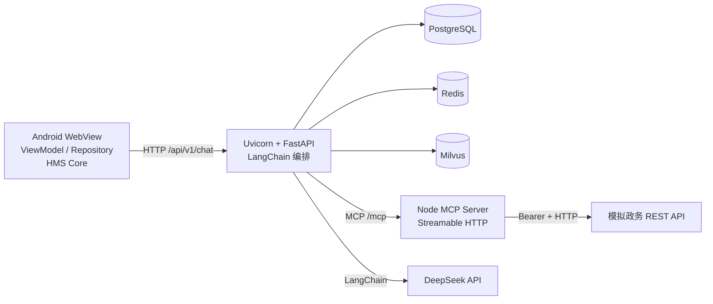

# 智慧政务助手架构

## 本地拓扑

Uvicorn 是 FastAPI 的 ASGI 运行器，不作为独立业务服务。MCP 使用独立容器和 Streamable HTTP，避免把 Node 子进程绑定到某个 Uvicorn worker。

## 一次问答的数据流

1. WebView 只把问题交给原生 JS Bridge；`AssistantViewModel` 调用 `GovAssistantRepository`。
2. FastAPI 校验匿名 `session_id` 和问题，在 PostgreSQL 中保存用户消息。
3. 后端先检查 Redis 中的检索上下文缓存；未命中时并发查询 Milvus 和 MCP。
4. MCP 工具调用模拟政务 API；Milvus 返回演示知识片段。
5. LangChain 将两类上下文交给 DeepSeek，回答始终带“演示数据”边界。
6. 后端保存助手消息和工具审计，返回来源、工具调用、缓存状态与降级警告。

## 故障边界

- PostgreSQL 不可用：请求返回 `503`，不生成无法持久化的会话。
- DeepSeek 不可用：请求返回 `502`，不以模板文本冒充模型回答。
- Redis 不可用：绕过缓存，继续检索。
- MCP 或 Milvus 单项不可用：使用剩余上下文继续回答，并在 `warnings` 中标记降级。
- `/health/ready` 只有在 PostgreSQL、Redis、Milvus、MCP 和模拟 API 全部正常时才返回就绪。

## 云端迁移边界

- 保持 API、MCP 与模拟/真实政务 API 的容器边界不变，替换环境变量中的服务地址。
- PostgreSQL、Redis、Milvus 可替换为托管服务；不需要修改 Android 契约。
- 在公网入口前增加 HTTPS 反向代理，并把 `.env` 替换为云端 Secret Manager。
- 接入真实政务 API 后删除模拟服务，并在 MCP Provider 中完成鉴权、授权、审计与字段脱敏。

