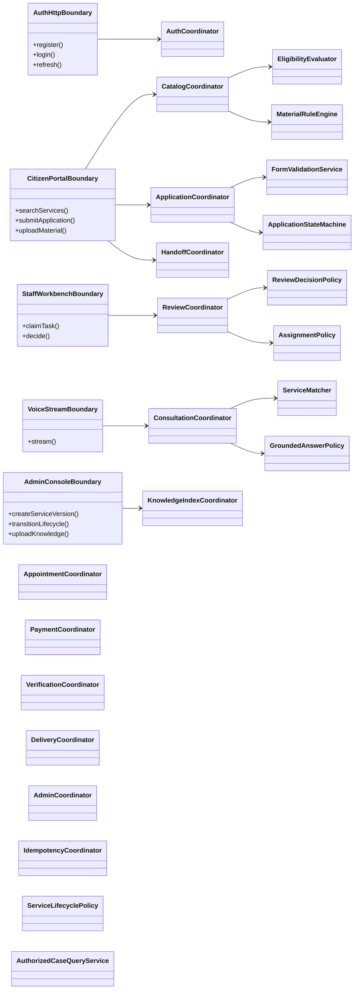
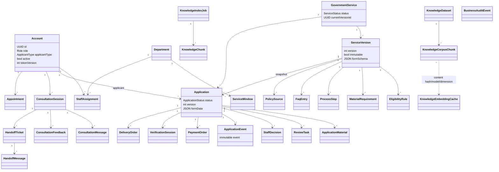
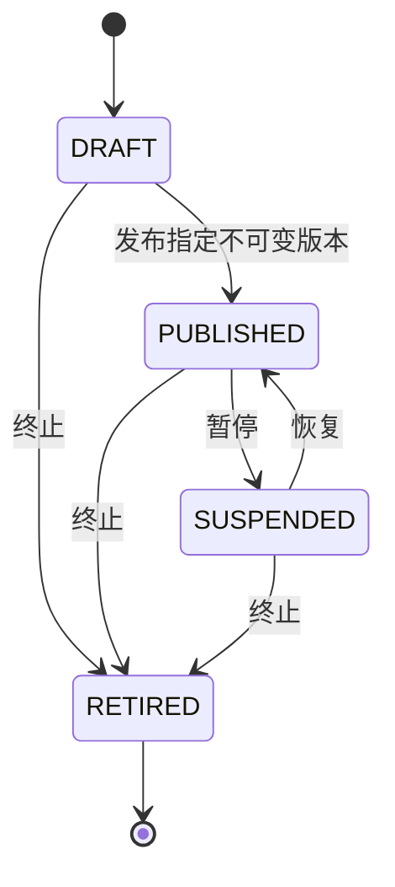
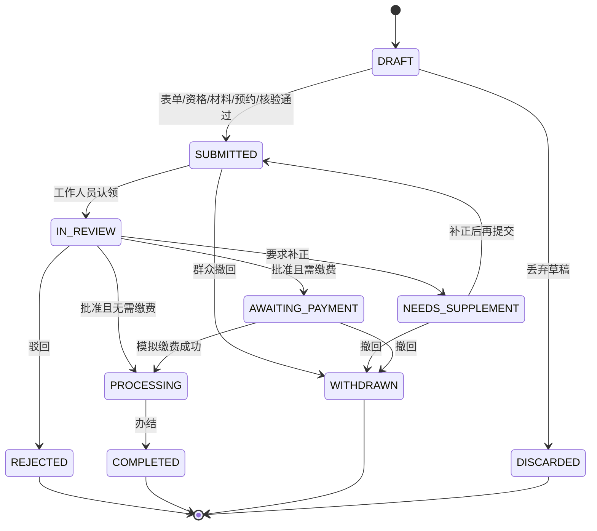
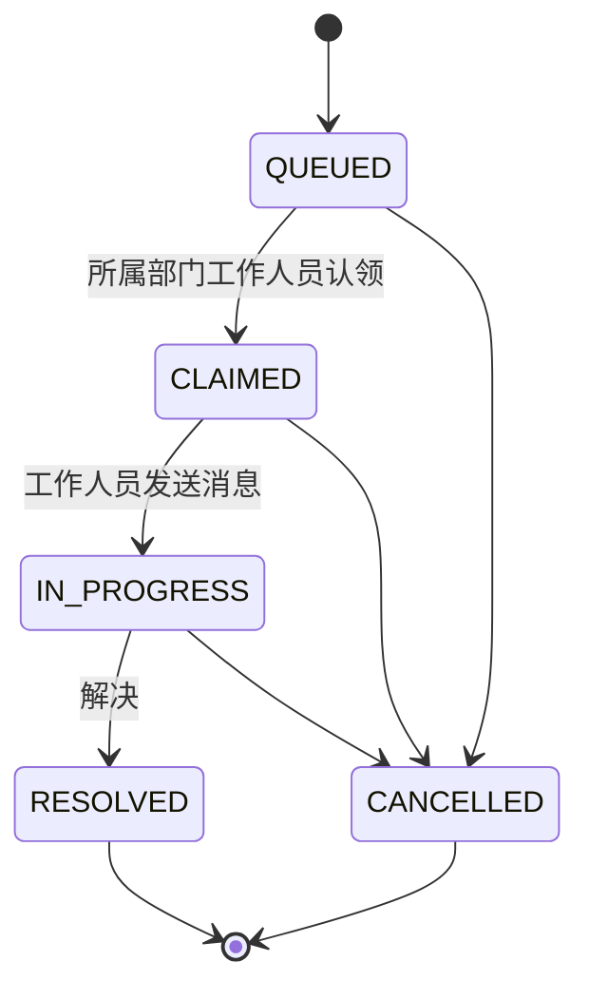
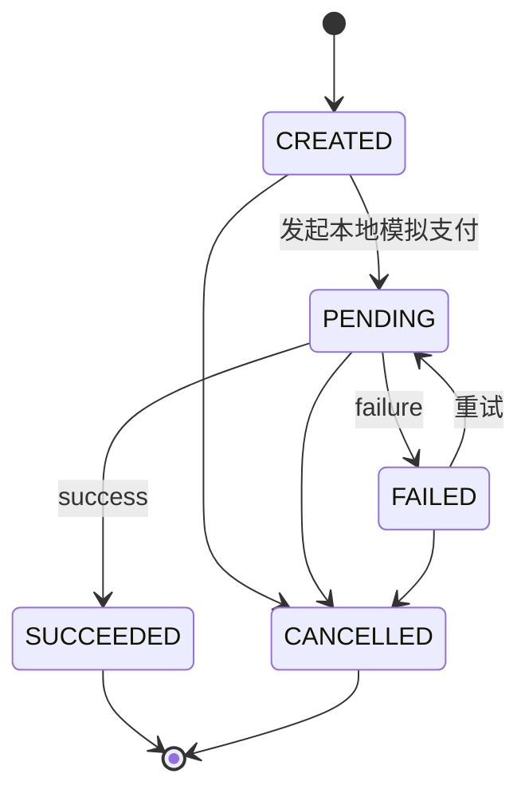
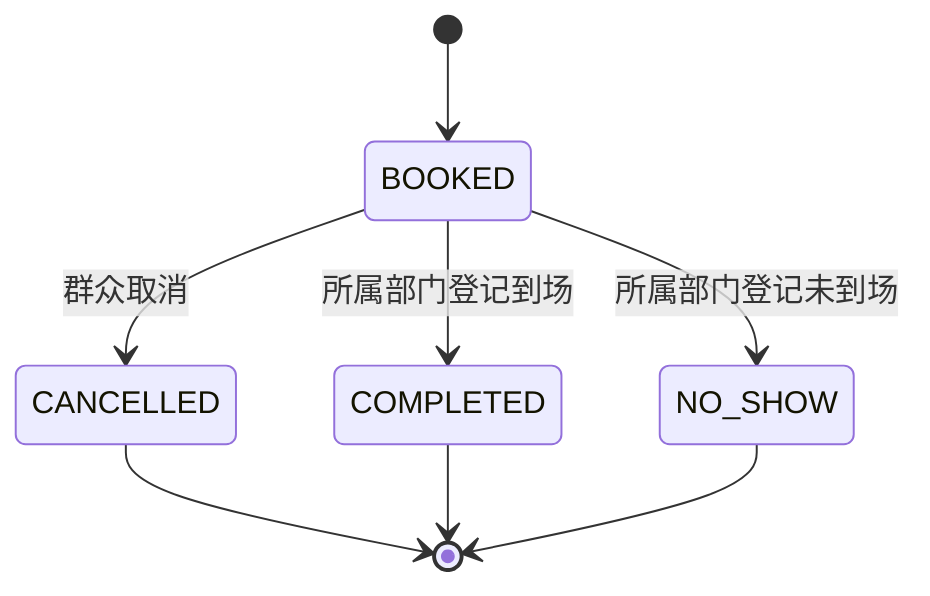
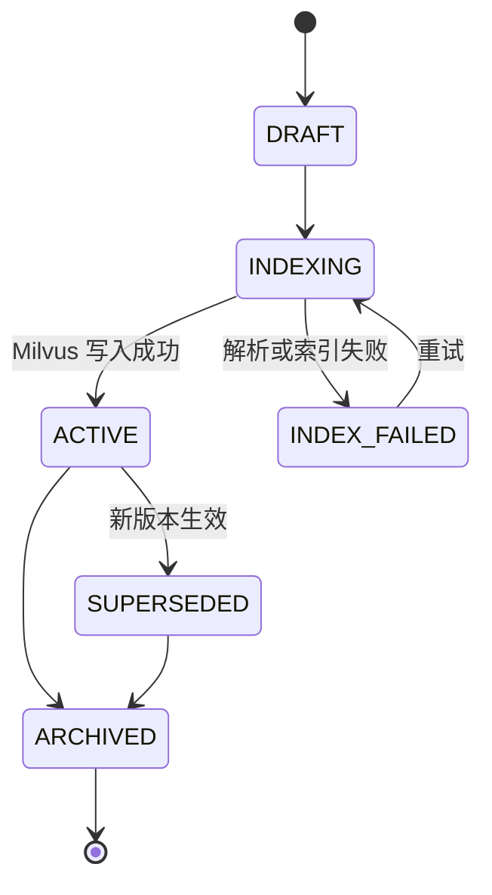
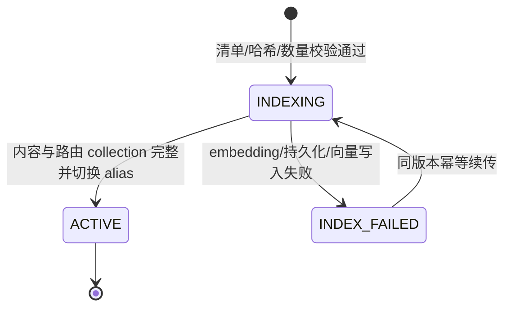
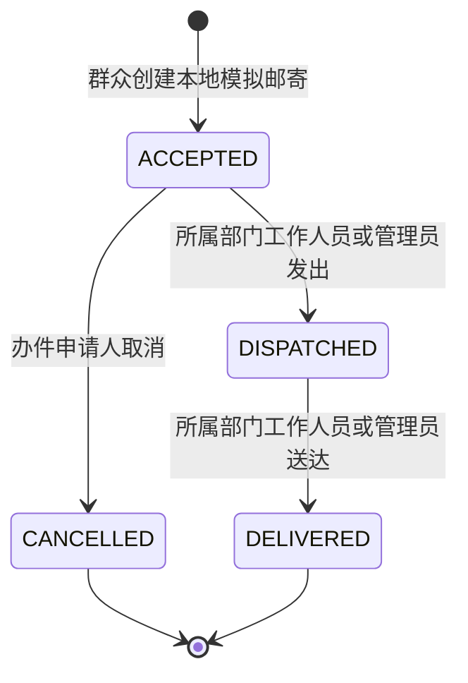

# 业务与领域设计

## 分层原则

后端采用 Boundary-Control-Entity（BCE）思路实现模块化单体。允许的依赖为“边界类 → 协调者类 → 领域实体/业务逻辑/端口”；基础设施适配器实现端口。领域层是可独立测试的纯 Python，不导入 FastAPI、SQLAlchemy、Redis、Milvus、MCP 或 Android 类型。

领域实体是普通 `dataclass`/枚举，用于表达规则和状态；SQLAlchemy 映射是基础设施细节，全部命名为 `*Record`。两者不能视为同一对象，也不能让数据库懒加载行为泄漏到领域规则。



## 类别清单

| 类别 | 后端主要类 | Android 主要类 | 责任边界 |
| --- | --- | --- | --- |
| 边界类 | `AuthHttpBoundary`、`CitizenPortalBoundary`、`StaffWorkbenchBoundary`、`AdminConsoleBoundary`、`OperationsBoundary`、`VoiceStreamBoundary` | `PortalJsBoundary`、`DocumentPickerBoundary`、`VoiceCaptureBoundary`、`TextToSpeechBoundary`、`WindowMapBoundary`、`SecureWebViewHost` | 输入校验、鉴权、协议/文件/SSE 转换和原生能力隔离，不判断业务状态 |
| 协调者类 | `AuthCoordinator`、`ConsultationCoordinator`、`ApplicationCoordinator`、`ReviewCoordinator`、`CatalogCoordinator`、`HandoffCoordinator`、`AppointmentCoordinator`、`PaymentCoordinator`、`VerificationCoordinator`、`DeliveryCoordinator`、`KnowledgeIndexCoordinator`、`RagCorpusImportCoordinator`、`AdminCoordinator`、`IdempotencyCoordinator` | `PortalCoordinatorViewModel`、`AuthCoordinator`、`CitizenCoordinator`、`StaffTaskCoordinator`、`AdminCoordinator`、`VoiceConsultationCoordinator` | 编排完整用例、权限入口、事务、幂等、审计和外部端口调用；团队语料导入仅由服务器运维入口触发 |
| 业务逻辑类 | `ServiceMatcher`、`EligibilityEvaluator`、`MaterialRuleEngine`、`FormValidationService`、`ApplicationStateMachine`、`ReviewDecisionPolicy`、`ServiceLifecyclePolicy`、`AssignmentPolicy`、`HandoffAccessPolicy`、`GroundedAnswerPolicy`、`AuthorizedCaseQueryService`、`PaymentStateMachine`、`HandoffStateMachine`、`AppointmentStateMachine`、`DeliveryStateMachine`、`KnowledgeStateMachine` | `PortalCommandPolicy`、`DynamicFormValidator`、`MaterialCompletionPolicy`、`RoleNavigationPolicy`、`SensitiveDisplayPolicy` | 独立判断资格、材料、状态迁移、部门权限、命令授权和敏感显示 |
| 实体类 | `Account`、`Department`、`ServiceWindow`、`GovernmentService`、`ServiceVersion`、`Application`、`ReviewTask`、`ApplicationEvent`、`HandoffTicket`、`Appointment`、`PaymentOrder`、`KnowledgeChunk` 等 | `PortalEntities` 中的强类型账户、事项、办件、待办和流式事件 | 表达领域身份和状态，不执行网络、数据库或 UI 操作 |
| 端口/适配器 | `BusinessRepository`、`SqlAlchemyCorpusRepository`、`ReadOnlyRagCorpusArchive`、`VersionedMilvusCorpusIndex`、`DashScopeEmbeddingAdapter`、`CompositeKnowledgeRetriever`、对象存储、MCP/LLM 与 Demo Provider | `AuthGateway`、`CatalogGateway`、`ApplicationGateway`、`StaffGateway`、`AdminGateway`、`StreamingGateway` 及 OkHttp/Keystore 实现 | 隔离持久化和外部系统，便于替换云端实现 |

## 领域聚合与关系



`Application` 固定引用提交时的 `ServiceVersion`，因此后续发布新版本不会悄悄改变已有办件规则。`ApplicationEvent` 和 `BusinessAuditEvent` 只追加；“删除”统一表示草稿丢弃、已提交撤回、账号冻结或事项终止。

## 规则引擎

资格和条件材料只解释受限 JSON DSL：`eq/ne/in/exists/lt/lte/gt/gte/all/any/not`。每个规则对象只能有一个操作符，字段按点路径读取；缺字段返回未知，不执行 Python、JavaScript、SQL 或表达式字符串。

```json
{
  "all": [
    { "eq": ["business.registration_status", "ACTIVE"] },
    { "exists": ["fund.contribution_base"] },
    { "gte": ["fund.contribution_ratio", 0.05] },
    { "lte": ["fund.contribution_ratio", 0.12] }
  ]
}
```

资格结果为 `ELIGIBLE`、`INELIGIBLE` 或 `NEEDS_INFORMATION`，并始终声明“仅供预检，不是正式审批结论”。材料分类为 `REQUIRED`、`CONDITIONAL_REQUIRED`、`OPTIONAL`、`NOT_APPLICABLE` 或 `NEEDS_INFORMATION`，同时返回触发原因。动态表单只实现项目需要的 JSON Schema 子集，并在服务端再次校验，不能信任 Android 本地校验。

## 状态模型

### 事项生命周期



发布版本不可原地编辑，需创建新 `ServiceVersion`；`RETIRED` 不可恢复。

### 办件生命周期



每个写入都核对 `version`。已提交办件不可物理删除；审核决定与事件/审计在同一数据库事务中写入。

### 转人工



群众发起人可将 `QUEUED/CLAIMED/IN_PROGRESS` 工单取消；只有所属部门工作人员可回复、推进并解决。`RESOLVED/CANCELLED` 均为终态。

### 缴费



只有 `ENVIRONMENT=local` 且显式启用 Demo Provider 时可推进；`provider_reference` 不是交易凭证。群众可取消自己的 `CREATED/PENDING/FAILED` 订单，成功或已取消订单不可再变更。

### 预约



群众可创建、列表和取消自己的预约；所属部门工作人员或管理员可通过 `/appointments/{appointment_id}/status` 将有效预约推进为 `COMPLETED/NO_SHOW`。所有状态写入都要求幂等键。

### 知识索引



当前管理员上传会完成解析、切分和本地索引协调；只有全部向量发布后任务和知识块才进入 `ACTIVE`。索引或发布失败时，409 的 `detail.job_id` 和成功上传响应都提供任务 ID；当前没有独立任务列表 API。`/admin/knowledge/{job_id}/retry` 只接受 `INDEX_FAILED`，每次增加 `attempts` 并保留最后错误；进程启动将遗留 `INDEXING` 恢复为 `INDEX_FAILED`，再以 PostgreSQL ACTIVE 块重新激活 Milvus。

`/admin/knowledge/{job_id}/archive` 只接受 `ACTIVE/SUPERSEDED`。归档保留文档、任务、对象和审计；若没有同文档的其他 ACTIVE 任务，将块标记 `ARCHIVED` 并移出 Milvus。重试或归档成功都会清除公开检索缓存，使下一次咨询重新取证。

### 版本化团队 RAG 数据集

团队语料与管理员知识是两个聚合：前者由服务器运维命令导入，不新增公开或管理员 HTTP 路由。固定净化数据集 `team-2026-08-22-v1` 包含 29 个主题、15,858 个正文分块和 1,012 个去重文档路由；它始终标记为“未核验演示参考”，不能覆盖本地事项权威数据。



`0005_rag_corpus` 保存数据集清单、每个分块的 `PENDING/INDEXED` 检查点，以及以 `(content_hash, model, dimension)` 唯一约束的 embedding 缓存。导入先离线净化并验证固定 SHA-256，再按批次生成 1,024 维 DashScope 向量；collection 名含 dataset 版本和归档哈希，内容/路由两个 alias 都完成切换后才可通过 `rag_corpus` readiness。失败不会把半成品 alias 暴露给查询，重试复用 PostgreSQL 检查点和已缓存 embedding。

### 模拟身份核验与邮寄

身份核验为 `CREATED → PASSED/FAILED/EXPIRED`，只存状态，不上传或保存音视频/生物模板。



当前 API 不连接真实快递；群众只能在 `ACCEPTED` 取消，工作人员不能跨部门，任何角色都不能跳过状态。

## 版本、幂等与并发

- 表单、材料和每次状态变更增加 `Application.version`；客户端提交旧版本返回 409。
- 提交、撤回、丢弃、审核、预约、缴费、核验、邮寄、各类取消、知识重试/归档要求 `Idempotency-Key`。
- 幂等记录同时保存载荷哈希；相同键 + 相同载荷重放已有结果，相同键 + 不同载荷返回冲突。
- 待办认领使用条件更新；并发时只有一个工作人员成功，其他请求得到 409。
- 事项版本一经发布为不可变；管理员创建下一版本后再显式切换当前版本。

## 授权查询和 AI 边界

`AuthorizedCaseQueryService` 只允许群众查看自己的办件、工作人员查看所属部门办件、管理员按管理权限查询。模型不能生成或执行任意 SQL；办件问答采用参数化白名单查询，并将结果限制为状态、事项名称等最小必要字段。

`ConsultationCoordinator` 是完整聊天用例协调者：建立上下文、持久化消息、调用公开缓存/MCP/RAG、应用 `GroundedAnswerPolicy`、调用模型并保存结果；HTTP/SSE 边界只负责协议映射。选择具体事项时，协调者从 PostgreSQL 当前已发布版本的 UUID、编码、标题和简介等白名单字段生成 `local_catalog` 来源。Redis 只缓存 MCP/RAG 检索结果，v3 键由规范化问题、外部事项映射 ID 和 dataset 版本共同隔离；`local_catalog` 每次重建。组合 RAG 对本地知识和团队语料执行 reciprocal-rank fusion，任一侧失败时返回明确 warning 并使用另一侧。

公开事项的 `local_catalog`、MCP 和 RAG 上下文可进入 LLM；账号资料、私人表单、材料内容、办件详情和身份信息禁止进入公共缓存或模型上下文。存在多个事项候选时，`ServiceMatcher` 返回澄清操作并跳过检索/模型，而不是猜测。

## 演示事项覆盖

| 外部演示 ID | 内部代码 | 申请人 | 重点场景 |
| --- | --- | --- | --- |
| 1001 | `DEMO-SS-CARD-001` | 个人 | 固定/条件材料、审核、邮寄 |
| 1002 | `DEMO-ID-REISSUE-001` | 个人 | 必须预约、模拟身份核验、缴费失败重试、邮寄 |
| 1003 | `DEMO-BL-REGISTER-001` | 个人 | 动态表单、经营场所条件、审核 |
| 1004 | `DEMO-ENTERPRISE-SS-001` | 企业 | 企业资格、经办授权、电子回执 |
| 1005 | `DEMO-LABOR-CONTRACT-001` | 企业 | 条件材料、缺失 422、备案审核 |
| 1006 | `DEMO-HOUSING-FUND-001` | 企业 | 比例范围、计算式费用、模拟缴付 |
